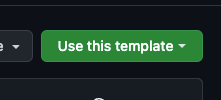

# Website Starter Template

This is a starter template to develop a website using a basic HTML/CSS/JS stack.

The template is bootstrapped with [Vite](https://vitejs.dev/) and has a structure that allows to work with SCSS to
handle the website styles implementing a **custom** architecture based on
the [7-1 pattern](https://sass-guidelin.es/#the-7-1-pattern).

## Getting started

To use the template as a starter for a new project you can press on the "_Use this template_" button on the top of the
page.



This will create a new repository with the same structure as this one.

If you want to clone the repository you can do it with the following command:

```bash
git clone https://github.com/AngelCruzL/website-starter.git
```

### Prerequisites

- [Node.js](https://nodejs.org/en/) (>= 18.0.0)
- [PNPM](https://pnpm.io/) (>= 6.0.0)

### Installation

```bash
pnpm install
```

### Development

```bash
pnpm dev
```

This will start a development server on [http://localhost:5173](http://localhost:5173). 