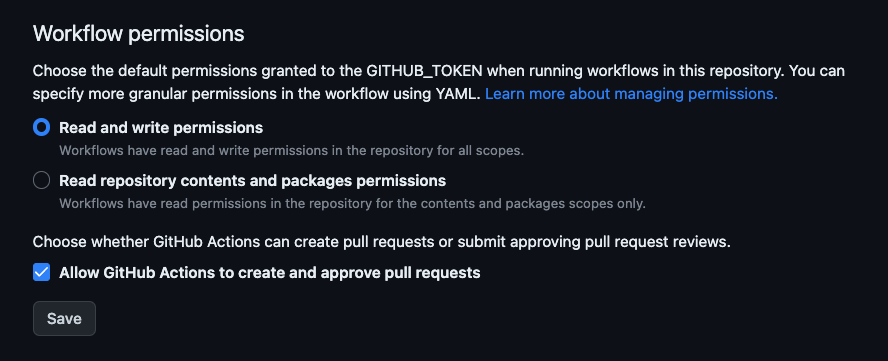
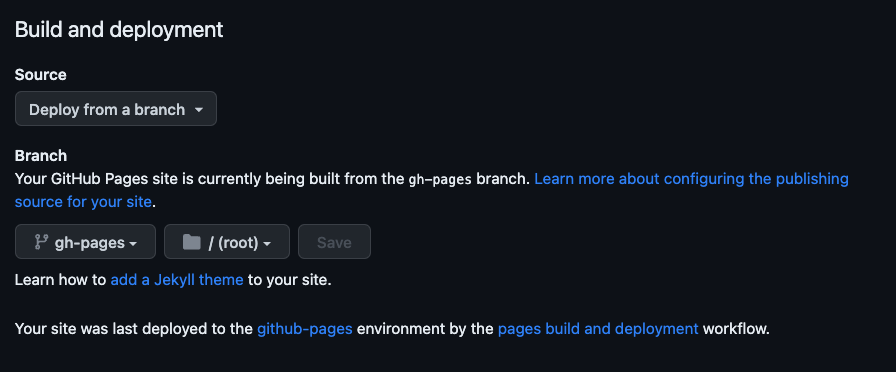

# Website Starter Template

This is a starter template to develop a website using a basic HTML/CSS/JS stack.

The template is bootstrapped with [Vite](https://vitejs.dev/) and has a structure that allows to work with SCSS to
handle the website styles implementing a **custom** architecture based on
the [7-1 pattern](https://sass-guidelin.es/#the-7-1-pattern).

## Getting started

To use the template as a starter for a new project you can press on the "_Use this template_" button on the top of the
page.


This will create a new repository with the same structure as this one.

If you want to clone the repository you can do it with the following command:

```bash
git clone https://github.com/AngelCruzL/website-starter.git
```

### Prerequisites

- [Node.js](https://nodejs.org/en/) (>= 18.0.0)
- [PNPM](https://pnpm.io/) (>= 6.0.0)

### Installation

```bash
pnpm install
```

### Development

```bash
pnpm dev
```

This will start a development server on [http://localhost:5173](http://localhost:5173).

### Build

As every Vite project, the build command will generate a production-ready version of the website.

```bash
pnpm build
```

## Deploy

By default, now the template has preconfigured a deployment to [GitHub Pages](https://pages.github.com/).
This thanks to the `deploy.yml` file in the `.github/workflows` folder. That file contains the configuration to
execute a GitHub Action that will deploy the website to the `gh-pages` branch.

Since this is a GitHub Action, it will only work if the repository is hosted on GitHub, also this works only on
the `main` branch and just on pull request action.

After your first commit, you can go to the **Actions** tab on your repository and see the action running, this will fail
because you need to make some changes to the repository configuration.

To finish this configuration you need to enable the next on the repository where you will to deploy (or store) your
project to make this work automatically:

- On the repository settings, go to **Actions/General** and enable the next configuration:



- Then go to **Pages** and enable the next configuration:



This allows you to deploy the website to the `gh-pages` branch and serve it from there. If you have problems with this
you maybe need make a Secret Key to work with the GitHub Action.